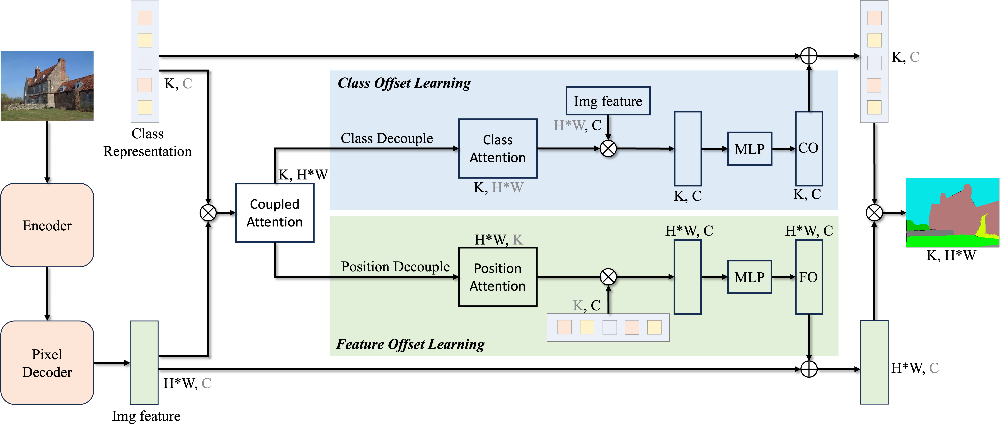

# Revisiting Efficient Semantic Segmentation: Learning Offsets for Better Spatial and Class Feature Alignment (ICCV 2025)

### [Project page](https://github.com/HVision-NKU/OffSeg) | [Paper](https://mftp.mmcheng.net/Papers/25ICCV-OffsetLearning.pdf) | [arXiv](https://arxiv.org/abs/2508.08811) | [中译版](resources/25ICCV-OffsetLearning-cn.pdf) | [Jittor]()

This repository contains the official Pytorch implementation of training & evaluation code and the trained models for [Offset Learning & OffSeg](https://arxiv.org/abs/2508.08811).

### Offset Learning —— An efficient plug-and-play semantic segmentation paradigm that replaces existing per-pixel classification paradigm to boost performance with negligible parameters.


*Overview of the Offset Learning framework for semantic segmentation.*

<details>
<summary>Abstract</summary>
Offset Learning is a new semantic segmentation paradigm that efficiently learns feature offsets and class offsets to dynamically refine both spatial features and class representations, addressing the inherent misalignment problem in per-pixel classification. Based on this paradigm, we design OffSeg, an efficient segmentation network that delivers consistent accuracy improvements on multiple benchmarks. Notably, the Offset Learning paradigm is plug-and-play, allowing it to directly replace other segmentation paradigms in existing models to achieve performance gains with only negligible parameter overhead.
</details>

## Features
* **Offset Learning**: Learns feature offsets and class offsets to dynamically refine spatial features and class representations.
* **Plug-and-play**: Compatible with existing segmentation frameworks like SegFormer, SegNeXt, and Mask2Former.
* **Lightweight & Efficient**: Achieves consistent accuracy gains on multiple benchmarks with negligible parameter overhead.
* **Proven Effectiveness**: Validated across diverse models and datasets, showing strong improvements especially in lightweight settings.

## News
- **`2025.08.13`**: Add [tutorial](toturials/Toturial:Using_Offset_Learning_In_Your_Own_Model.md) on how to apply the Offset Learning paradigm to your own models.
- **`2025.08.12`**: The full training & evaluation code and the trained models are released.
- **`2025.06.26`**: Our paper is accepted to ICCV 2025!

## TODO
* [x] Release the full training & evaluation code and model weights. 
* [x] Tutorial on how to apply the Offset Learning paradigm to your own models.
* [ ] Release the jittor version for jittor users.
* [ ] Release the Python library for easier installation via `pip install`.
* [ ] Explore the generalization ability of Offset Learning on tasks beyond semantic segmentation.

## Get Started

### Installation

```bash
conda create -n offseg python=3.9 -y
conda activate offseg

# Install PyTorch (CUDA 11.8 example)
conda install pytorch==2.0.0 torchvision==0.15.0 torchaudio==2.0.0 pytorch-cuda=11.8 -c pytorch -c nvidia

# install mmcv using mim
pip install -U openmim
mim install mmengine
mim install mmcv==2.0.0
mim install mmdet

pip install ftfy transformers==4.28.0

# Install OffSeg
pip install -e .
```

### Data Preparation

For data preparation, please refer to the guidelines in [mmsegmentation](https://github.com/open-mmlab/mmsegmentation/blob/main/docs/en/user_guides/2_dataset_prepare.md#prepare-datasets).
It is recommended to symlink the dataset root to `OffSeg/data`.

<details>
<summary>For convenience, the recommended folder structure is as follows: </summary>

```
OffSeg
├── data
│   ├── ade
│   │   ├── ADEChallengeData2016
│   │   │   ├── annotations
│   │   │   │   ├── training
│   │   │   │   ├── validation
│   │   │   ├── images
│   │   │   │   ├── training
│   │   │   │   ├── validation
│   ├── cityscapes
│   │   ├── leftImg8bit
│   │   │   ├── train
│   │   │   ├── val
│   │   ├── gtFine
│   │   │   ├── train
│   │   │   ├── val
│   ├── coco_stuff164k
│   │   ├── images
│   │   │   ├── train2017
│   │   │   ├── val2017
│   │   ├── annotations
│   │   │   ├── train2017
│   │   │   ├── val2017
│   ├── VOCdevkit
│   │   ├── VOC2010
│   │   │   ├── JPEGImages
│   │   │   ├── SegmentationClassContext
│   │   │   ├── ImageSets
│   │   │   │   ├── SegmentationContext
│   │   │   │   │   ├── train.txt
│   │   │   │   │   ├── val.txt
│   │   │   ├── trainval_merged.json
```

</details>

### Checkpoints

The trained models can be downloaded at:
| Model                          | GoogleDrive | OneDrive | BaiduNetdisk |
|--------------------------------|-------------|----------|--------------|
| OffSeg                         | [GoogleDrive](https://drive.google.com/drive/folders/1RpQ1ouZJpiIPQU0nRpl9wGeOVoQ-_ZEy?usp=sharing) | [OneDrive](https://mailnankaieducn-my.sharepoint.com/:f:/g/personal/zhangshichen_mail_nankai_edu_cn/Er6Lo--3WIlCnj03f6xOzJkBhuJuNDpdBJoTsTJa0vbQgQ) | [BaiduNetdisk](https://pan.baidu.com/s/1iMyz_u46antonjauVuaXcg?pwd=2025) |
| SegFormer w/ Offset Learning   | [GoogleDrive](https://drive.google.com/drive/folders/1IADpcyR6Ld1_kLmKF2FV9y_hwZtNUPOB?usp=sharing) | [OneDrive](https://mailnankaieducn-my.sharepoint.com/:f:/g/personal/zhangshichen_mail_nankai_edu_cn/EnE8OIJwszFPrf0yJcugkQABLjthQQzwJagbJm6rbK6IZw) | [BaiduNetdisk](https://pan.baidu.com/s/1yqil_EQkXJHokza5jNuGPg?pwd=2025) |
| SegNeXt w/ Offset Learning     | [GoogleDrive](https://drive.google.com/drive/folders/1OHgoN3wpWmqEHdtqxyBCwCy5k7m_vZlJ?usp=sharing) | [OneDrive](https://mailnankaieducn-my.sharepoint.com/:f:/g/personal/zhangshichen_mail_nankai_edu_cn/Eif6LjQW145Lg-gAOnpwqWABnDIQvMRoeH6j5HiZd6MQzg) | [BaiduNetdisk](https://pan.baidu.com/s/1S8VadoubEPJj-vB2-lUIEg?pwd=2025) |
| Mask2Former w/ Offset Learning | [GoogleDrive](https://drive.google.com/drive/folders/13bsb0XTtw1nXfPpmA4FThZ3j1ZZN8_PL?usp=sharing) | [OneDrive](https://mailnankaieducn-my.sharepoint.com/:f:/g/personal/zhangshichen_mail_nankai_edu_cn/Esv293NPghdMmnB6G36RY0UBi2lb6AeXAxYR4W_xwoy4jA) | [BaiduNetdisk](https://pan.baidu.com/s/1M7i7ETrIEZ-nLnbt96yTUg?pwd=2025) |

## Evaluation

### Single GPU Evaluation

```bash
# OffSeg-T on ADE20K
python tools/test.py local_configs/offseg/Tiny/offseg-t_ade20k_160k-512x512.py /path/to/checkpoint.pth

# SegFormer-B0 with Offset Learning on COCO-Stuff
python tools/test.py local_configs/segformer_offset_learning/B0/segformer_mit-b0_offset_learning_8xb2-80k_stuff164k-512x512.py /path/to/checkpoint.pth

# SegNeXt-T with Offset Learning on Pascal Context
python tools/test.py local_configs/segnext_offset_learning/Tiny/segnext_mscan-t_offset_learning_80k_pascal-context-59_480x480.py /path/to/checkpoint.pth
```

### Multi-GPU Evaluation

```bash
# Example with 8 GPUs
bash tools/dist_test.sh local_configs/offseg/Tiny/offseg-t_ade20k_160k-512x512.py /path/to/checkpoint.pth 8
```

### Evaluation with Visualization

```bash
# Show results during evaluation
python tools/test.py local_configs/offseg/Tiny/offseg-t_ade20k_160k-512x512.py /path/to/checkpoint.pth --show

# Save visualization results
python tools/test.py local_configs/offseg/Tiny/offseg-t_ade20k_160k-512x512.py /path/to/checkpoint.pth --show-dir ./vis_results
```

## Training

### Single GPU Training

```bash
# Train OffSeg-B on ADE20K
python tools/train.py local_configs/offseg/Base/offseg-b_ade20k_160k-512x512.py

# Train with custom work directory
python tools/train.py local_configs/offseg/Base/offseg-b_ade20k_160k-512x512.py --work-dir ./work_dirs/offseg-b_ade20k_160k-512x512

# Resume training from checkpoint
python tools/train.py local_configs/offseg/Base/offseg-b_ade20k_160k-512x512.py --resume
```

### Multi-GPU Training

```bash
# Example with 8 GPUs
bash tools/dist_train.sh local_configs/offseg/Base/offseg-b_ade20k_160k-512x512.py 8
```

## Visualization

### Image Demo

```bash
# Single image inference
python demo/image_demo.py demo/demo.png local_configs/offseg/Tiny/offseg-t_ade20k_160k-512x512.py /path/to/checkpoint.pth --out-dir ./demo_results
```

## Citation

If you find this work useful for your research, please cite our paper:

```bibtex
@article{zhang2025revisiting,
  title={Revisiting Efficient Semantic Segmentation: Learning Offsets for Better Spatial and Class Feature Alignment},
  author={Zhang, Shi-Chen and Li, Yunheng and Wu Yu-Huan and Hou, Qibin and Cheng, Ming-Ming},
  journal={arXiv preprint arXiv:2508.08811},
  year={2025}
}
```

## Acknowledgment

This project is built upon [MMSegmentation](https://github.com/open-mmlab/mmsegmentation). We thank the MMSegmentation team for their open-source contribution.
We also thank the following open-source projects for their inspiring work: [SegFormer](https://github.com/NVlabs/SegFormer), [SegNeXt](https://github.com/visual-attention-network/segnext), [Mask2Former](https://github.com/facebookresearch/Mask2Former), [FreqFusion](https://github.com/Linwei-Chen/FreqFusion), [EfficientFormerV2](https://github.com/snap-research/EfficientFormer).


## License
The code is limited to non-commercial, academic, or research purposes only. For commercial use, please contact the authors for licensing.

## Contact

For questions and issues, please contact:
- Email: [zhangshichen@mail.nankai.edu.cn]
- Issues: [GitHub Issues](https://github.com/HVision-NKU/OffSeg/issues)
